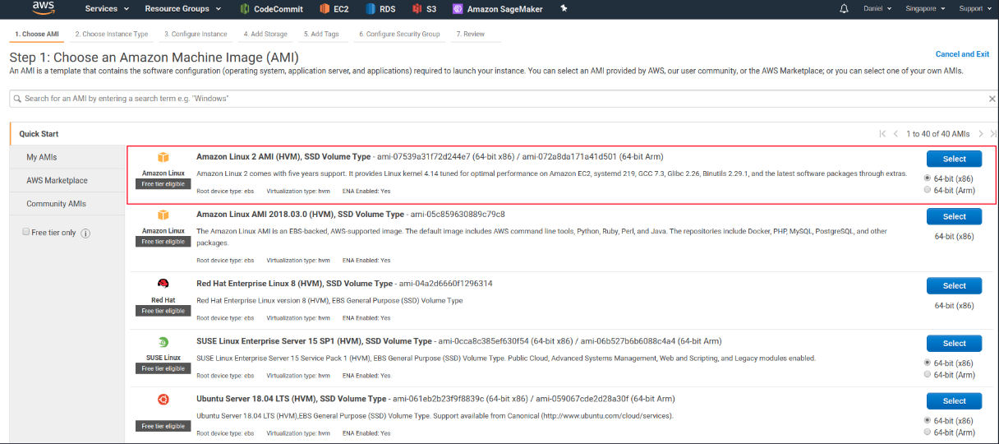
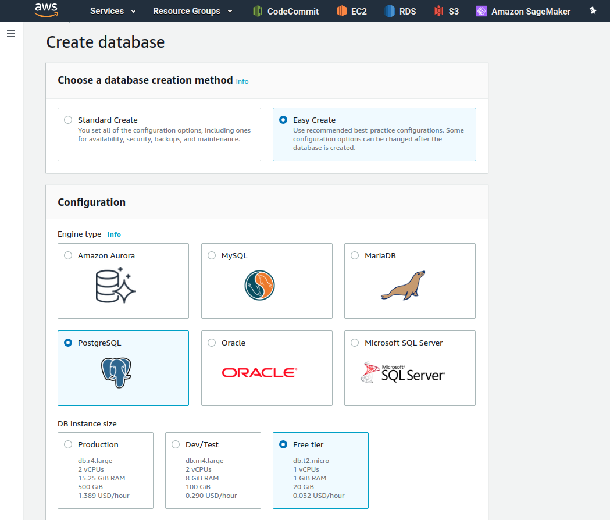
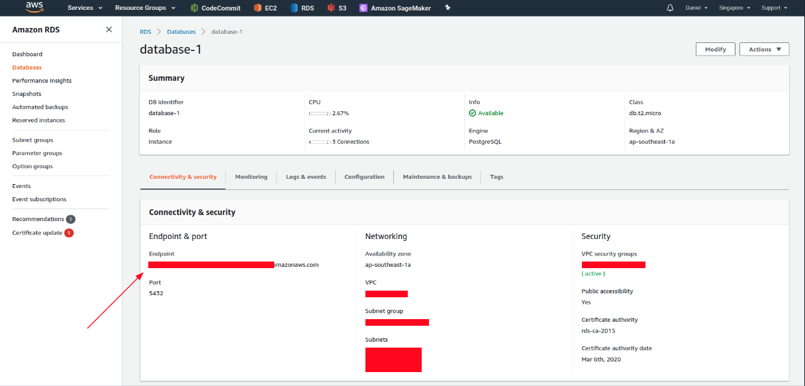
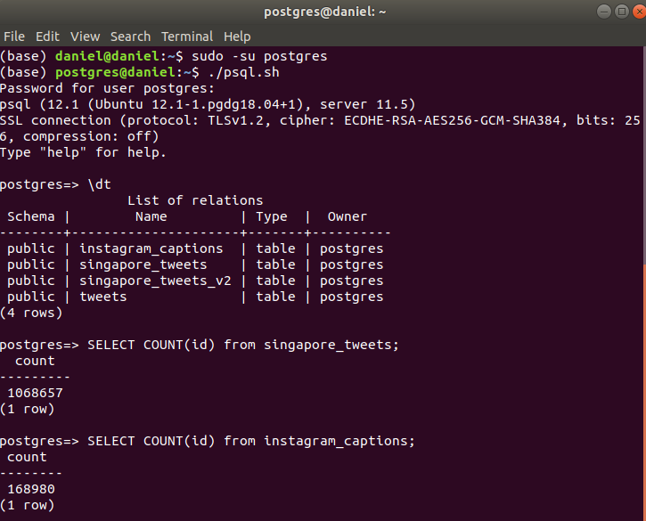
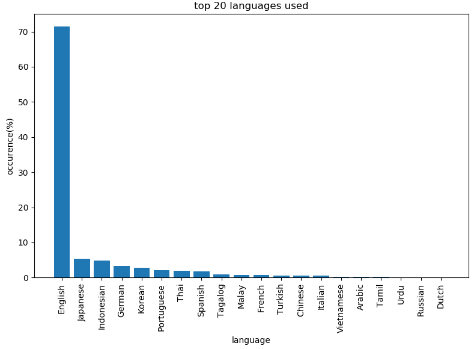

# Analysis of Social Media Data about Singapore

Singapore is a multi-racial and multi-cultural society with 4 main languages. This repository documents the journey to derive insights from textual social media data, from *Twitter* and *Instagram*, about Singapore with the following potential areas of exploration:

1) Proportion of languages used

2) Trending topics

3) Sentiment Analysis on trending topics as well as internal vs external data

4) Named-Entity Recognition 


As no datasets on social media data about Singapore are publicly available, data will be mined from the aforementioned social media platforms using AWS before being used for analysis. As such, this project will be segmented into 4 parts:

1) Data mining using AWS

2) Data cleaning & labelling using NLTK and spaCy

3) Building/Training/Usage of various AI Models

4) Extraction and visualization of results


The following graph showcases the overall approach for this project:


# Data mining using AWS

To collect data from *Twitter* and *Instagram*, we first need to create an EC2 instance on AWS to run the mining scripts indefinitely.

As the scripts are generally lightweight, we do not need heavy computing power. We will hence be using the the basic Amazon Linux instance which will be enough to fulfil our requirements. Although the instance is in the free-tier, please note there are hidden charges after a certain usage duration as well as for data transfer/storage options. Check out the pricing at this link: https://aws.amazon.com/ec2/pricing/



Next, head to AWS RDS to create a database where we will store the collected text data. PostgreSQL will be used in this guide. Note that there are also hidden charges and it is important to first check out their pricing plans before creation of any instances.



It will take a while for AWS to provision your resources. Once it is up and running, go into your database instance to copy its endpoint- we would need this to post data to our database from our ec2 instance. If you run into authentication problems, head to IAM and create a role that allows your AWS RDS instance to interface with your AWS EC2 instance: https://docs.aws.amazon.com/IAM/latest/UserGuide/id_roles.html



We are now ready to run our mining scripts on our ec2 instance(almost)! Access to all tweets must first be authenticated by a user account's key and token. Follow this guide provided by Twitter to generate your access keys and tokens, which would be needed for our Twitter mining scipt: https://developer.twitter.com/en/docs/basics/authentication/oauth-1-0a/obtaining-user-access-tokens.

The *Tweepy* wrapper that modularizes the twitter API will be used to further simplify our mining script, install it in the ec2 instance using pip:
```
pip install tweepy
``` 

For Instagram, we will be mining the captions of posts related to Singapore. Scrapping data via the HTML way will allow us to mine more data as well as avoid having to use the Instagram API. However, they are very good at detecting mining bots and may excercise rate-limiting based on the IP address of the ec2 instance.

The *Instaloader* wrapper is an awesome, well documented library that like Tweepy, modularizes mining functions, making it really simple for us to mine data from instagram. Do check them out: https://github.com/instaloader/instaloader

```
pip install instaloader
```

Lastly, download the *twitter_crawler.py* and *insta_crawler.py* file from this repository and transfer them to your ec2 instance(using transfer protocols such as scp or putty). Do not forget to change the credentials of the database endpoint and Twitter access tokens.

Use the in-built terminal multiplexer to concurrently run both scripts:
```
tmux new -s twitter #creates new instance
tmux attach -t twitter #attaches to the newly created instance
python twitter_crawler.py #starts the mining script
Ctrl+B D #detaches from the terminal instance without terminating the script

--Repeat for insta_crawler.py--
```

To ensure that both scripts are actually mining, we can either access the database through pgAdmin4(browser interface for postgreSQL) or log in via the command line(need to have postgresql installed):
```
sudo -su postgres
psql -h (your aws rds endpoint)
\dt
```

You should see both the *instagram_captions* and the *singapore_tweets* tables present. Use SQL to confirm that they are not empty:
```
SELECT COUNT(id) from singapore_tweets;
SELECT COUNT(id) from instagram_captions;
```



Due to rate limiting, it may take some time to mine a sizable amount of text data. It took around 2 weeks to mine a million tweets. Additionally, a column indicating if the tweet is a retweet or not is saved. As duplicates are allowed, saving the retweet label as a binary count was chosen instead of the actual count. This is because the actual count may lead to unproportional emphasis on the retweet if numbers reflected are high.

# Data Cleaning

Data cleaning is probablity the most important part of the whole process as the model only performs as well as the quality of the data you feed it.

A brief glimpse into the dataset shows that it contains a lot of noise, we will hence clean it based on these conditions:

1) Punctuation - These markers are mostly neutral and does not significantly influence any language tasks.
2) Website links - Useless based on the objectives defined above.
3) Mentioned usernames - Useless based on the objectives defined above.
4) Emoticons - This is a special case: it is not useful when doing tasks like language recognition but may be useful in sentiment analysis.
5) Stop words - Holds little meaning as it serves to structure the sentence. However, it depends on the model used: if the model contextualizes the sentence, it can prove to be useful.

The first three conditions will be done in all cases but conditions 4 and 5 may or may not be done based on the nature of the employed model.

The first three conditions can be easily done in python with an array and iteration through each tweet on the character level(refer to *filter_tweets.py*). Although emoticons can be removed the same way, new emoticons are being created everyday. It is best to use a library that constantly updates their list of reference emoticons to ensure high quality filtering of emoticons:
```
pip install demoji
```

**--Other parts in progress--**

# Proportion of languages used

We begin our analysis by determining the spread of languages used. As most models are only compatible with english, this can help us understand what kind of data we will need in order to build a multilingual model. To first build a language recognition model, we can train it in an unsupervised manner by concatenating different datasets of different languages and train it with labels given based on it's language. However, this will prove to be an arduous task as massive datasets would be needed to account for the languages supported and a large corresponding vocabulary. Fortunately, the research team at *Facebook* have open sourced their language detection model: fastText.

Install the python version of fastText:
```
pip install fasttext
```

Head to this link to download their model that supports an extensive 176 languages: https://fasttext.cc/docs/en/language-identification.html

Subsequently, we use a hash table to count the occurrences of detected languages. We then sort the hash table and visualize the top 20 languages tweeted based on our mined dataset using matplot. Refer to *language_visualization.py* for the script used. The obtained bar chart is displayed below:



From our results, it is surprising to see Japanese as the second most used language.

**--Other parts in progress--**


